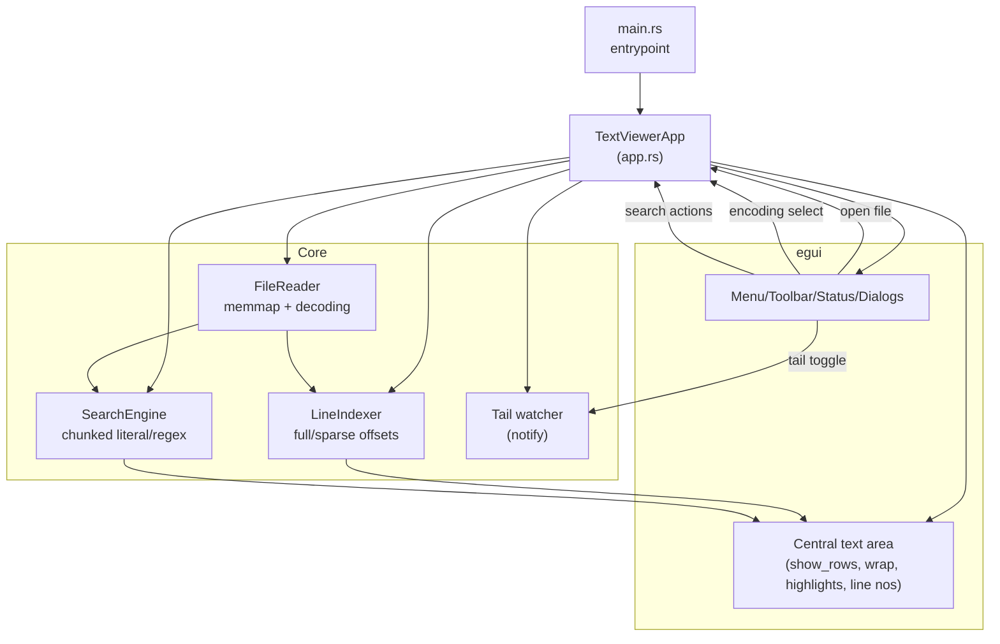
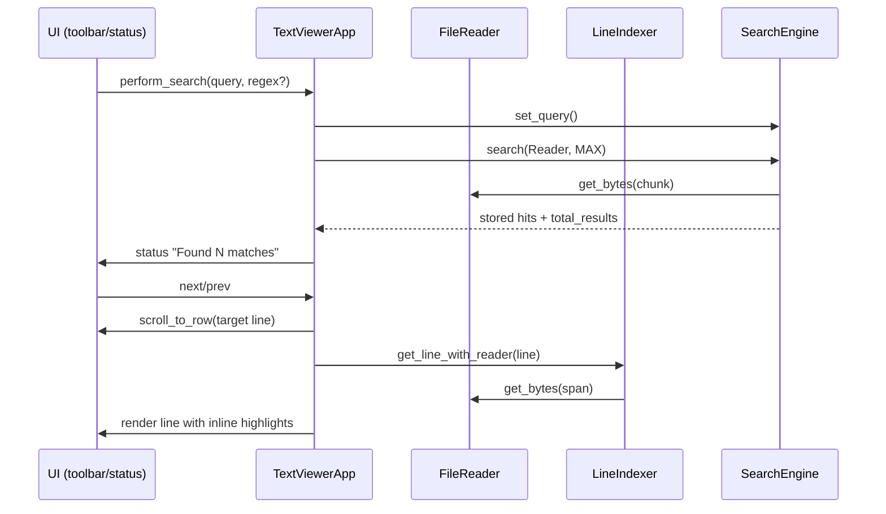

# Large Text Viewer — Architecture (Mermaid)

## Component Map

## Search/Data Flow

## Notes
- File open: UI → open_file → FileReader mmap + LineIndexer index → status update.
- Rendering: visible rows only; LineIndexer supplies byte spans; FileReader decodes; UI draws text + per-match highlights.
- Tail mode: notify watcher reloads file, reindexes, and can auto-scroll to bottom.
- Encoding: selector swaps `selected_encoding` and reopens file.